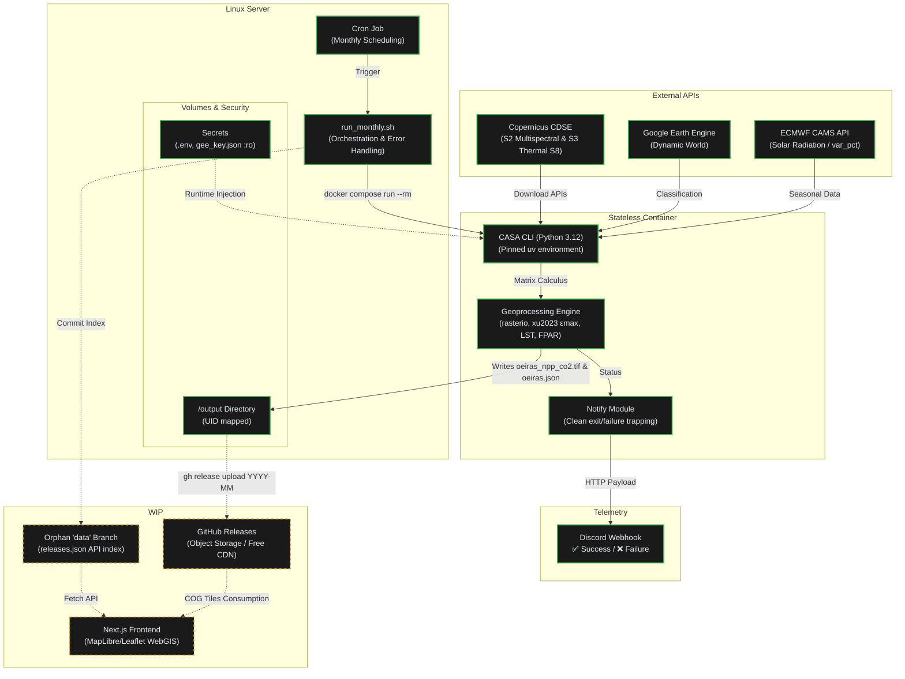

# Urban Carbon Sink

A stateless data pipeline that estimates the **monthly CO₂ sequestration of urban
vegetation** in Oeiras (Portugal) from satellite imagery, using the CASA
(Carnegie–Ames–Stanford Approach) Net Primary Productivity model.

Each month a disposable container pulls Sentinel-2/3, Google Dynamic World and
CAMS solar data, runs the geoprocessing, and publishes a Cloud-Optimized GeoTIFF
plus a JSON summary to GitHub Releases — no always-on server, no runtime
infrastructure.

## Architecture



## Engineering Principles

- **Stateless / Ephemeral** — the runtime is a `python:3.12-slim` container that
  is created on a schedule, does its work, writes its artifacts to a bind-mounted
  directory, and exits (`docker compose run --rm`). Nothing runs 24/7.
- **Reproducible** — the full dependency graph is pinned in `uv.lock` and
  installed with `uv sync --frozen`; the same locked, universal lockfile drives
  both local development and the production image. A given input month yields a
  byte-identical computation regardless of host.
- **Secure by Design** — no credentials are ever baked into the image. The `.env`
  and the read-only service-account key are injected only at runtime
  (`env_file` + `:ro` bind mount), and `.dockerignore` keeps them out of the
  build context. The container runs non-root; GitHub credentials live only on the
  host, never inside the container.
- **Automated** — a single host cron entry triggers the month's run; results are
  pushed to **GitHub Releases** (used as free, CDN-backed object storage) and a
  Discord webhook reports success or failure, so the pipeline needs no human
  babysitting.

## The model

CASA NPP per pixel:

```
NPP = PAR_fraction · SOL · FPAR · ε_max · T_ε1 · T_ε2 · W_ε
```

Inputs are derived from Sentinel-2 reflectance (NDVI → FPAR; SWIR → water
stress), Sentinel-3 SLSTR S8 brightness temperature (thermal stress), Dynamic
World land cover (per-class ε_max from the traceable Xu et al. 2023 / MODIS
BPLUT table), and a CAMS-derived seasonal solar factor. NPP is converted to CO₂
(× 44/12) and integrated over the municipal geometry. See [`docs/`](docs/) for
the model derivation and the architecture decision records.

## Running Locally

Prerequisites: Docker, a `.env` (from `.env.example`), and a Google Earth Engine
service-account key.

```bash
# 1. credentials
cp .env.example .env                 # fill in CDSE / CAMS / Discord values
# place your GEE service-account key at ./gee_key.json (git-ignored, mounted :ro)

# 2. build the pinned image
docker compose build

# 3a. compute only (no publishing)
docker compose run --rm casa run --online -r oeiras -m 2025-04 \
  --base-ghi data/sol/ghi_base.tif --out output

# 3b. full monthly run via the wrapper (compute + Discord + GitHub Release)
./deploy/run_monthly.sh oeiras 2025-04
```

Outputs land in `output/`: `oeiras_npp_co2.tif` (Cloud-Optimized GeoTIFF, CO₂
density) and `oeiras.json` (totals + carbon balance). Scheduling and the
publishing setup (`gh auth`, the orphan `data` branch) are documented in
[`deploy/README.md`](deploy/README.md).

## Tests

```bash
uv sync --extra dev
uv run pytest -q          # unit + integration (synthetic fixtures, no network)
uv run ruff check src tests
uv run mypy
```

## License

MIT — see [LICENSE](LICENSE).
